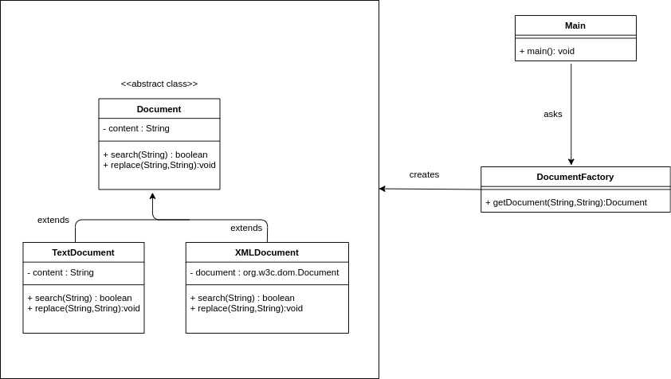

# searchreplace

## About

**searchreplace** is a Java program can search and replace a specific text phrase in a text file,
and search and replace a specific text phrase in the attribute values of an XML file.

## Usage

The program accepts 3 command line parameters :

1. fileDataType : the type of data sent on standard input (xml or text).
2. oldString : the string that we want to replace.
3. newString : the new string.

The program can read from standard input and write to standard output.

## UML class diagram of the program:

Following the Factory Method design pattern, the Main class asks the Document to create a text or xml document,
based on fileDataType entered by the user.
The TextDocument and XMLDocument extends from Document abstract class.

## Testing

I used JUnit 5 as unit testing framework.
